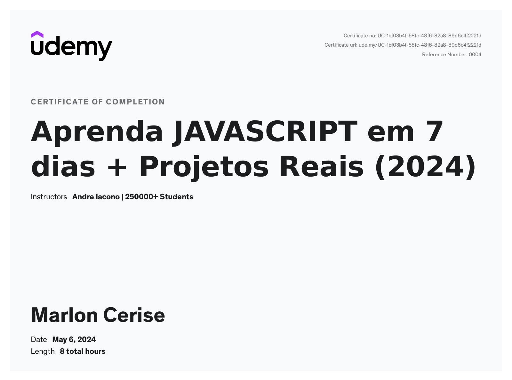

# Aprenda JAVASCRIPT em 7 dias + Projetos Reais (2024)

## Course Overview

This repository contains all the projects and exercises completed during the JavaScript course. Throughout the course, you learned JavaScript from scratch and practiced your skills by completing various projects. You covered a wide range of topics including:

- Variables
- If/else statements
- Operators
- Boolean logic
- Functions
- Arrays
- Objects
- Loops
- Strings
- And much more!

## What I Have Learned

- Learned JavaScript programming language from scratch with practical exercises.
- Practiced my skills by completing various course projects.
- Gained a deep understanding of variables, if/else statements, operators, boolean logic, functions, arrays, objects, loops, strings, and more.
- Prepared myself for the job market by understanding how JavaScript really works.
- Gained insights into how JavaScript developers work on a daily basis.
- Learned all about Object-Oriented Programming (OOP) with JavaScript, working with prototypes and classes.

## Course Certificate

You can find **my course completion certificate** [here](https://udemy-certificate.s3.amazonaws.com/pdf/UC-1bf03b4f-58fc-48f6-82a8-89d6c4f2221d.pdf)

---

*This repository contains all the exercises and projects completed during the JavaScript course on Udemy.*
